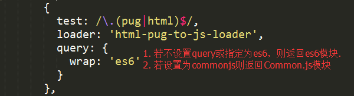
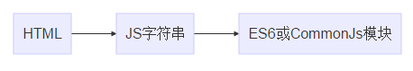
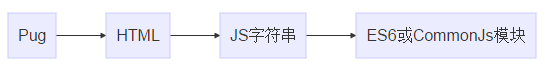

#### 实现功能：

###### 这是一个WebPack的loader，实现html或者pug文件转为js模块，用于开发模板分离的前端组件（可以实现语法高亮）


##### 使用步骤图示


##### 使用步骤详细
###### 1. 安装loader模块
npm install html-pug-to-js-loader --save-dev
###### 2. webpack loader配置

      {
        test: /\.(pug|html)$/,
        loader: 'html-pug-to-js-loader',
        query: {
          wrap: 'es6'
        }
      },
      
###### 3. 代码中使用

```
import tpl from './b.pug';
import t  from './c.html';
var e = require('./b.pug');
var h = require('./b.html');
```

##### 4. 工作示意图
###### HTML转为JS

###### Pug转为JS


##### 5. 注意事项
###### query的wrap有两个可选值 es6 或 commonjs 
